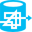

Azure Vector Icons
==================

A set of vector (SVG) icons depicting Microsoft Azure Platform Services. Designed as a common icongraphic language for use by Architects, Developers and Operations to document and build Azure Platform Services.

The Icons
=========

Analytics
---------

| Icon | Title |
|:---- |:----- |
|  | Operational Insights |

Big Data
--------

| Icon | Title |
|:---- |:----- |
|  | HDInsight (Old) |
|  | HDInsight |
|  | Machine Learning |

Code
----

| Icon | Title |
|:---- |:----- |
|  | BitBucket (Code Source) |
|  | Code File |
|  | Codeplex (Code Source) |
|  | CSCFG (Cloud Service Configuration) File |
|  | CSDEF (Cloud Service Definition) File |
|  | CSPKG (Cloud Service Package) |
|  | Dropbox (Code Source) |
|  | File (Black) |
|  | File |
|  | Git Deployment |
|  | GitHub (Code Source) |
|  | PowerShell File |
|  | RDP (Remoting File) |
|  | Script File |
|  | Startup File |
|  | WAD (Diagnostics) Config |
|  | WAD (Diagnostics) Config |

Compute
-------

| Icon | Title |
|:---- |:----- |
|  | API Management |
|  | Automation |
|  | Autoscale |
|  | Batch Services |
|  | Cloud Service |
|  | Media Services |
|  | Mobile Services |
|  | RemoteApp |
|  | Scheduler |
|  | Service Fabric Cluster |
|  | Virtual Machine - ElasticSearch |
|  | Virtual Machine |
|  | Virtual Machines |
|  | Web Role |
|  | Web Roles |
|  | Websites |
|  | Website (Generic) |
|  | Worker Role |
|  | Worker Roles |

Data
----

| Icon | Title |
|:---- |:----- |
|  | Backup Service |
|  | Database Generic |
|  | MySQL Database |
|  | Operating System Image |
|  | SQL Database (Generic) |
|  | SQL Database (SQL Azure) |
|  | SQL DataSync |
|  | Storage Blob |
|  | Storage Table |
|  | Stream Analytics |
|  | VHD Data Disk |
|  | VHD |

Identity
--------

| Icon | Title |
|:---- |:----- |
|  | Azure Active Directory |
|  | Azure Active Directory Access Control Services (ACS) |

Messaging
---------

| Icon | Title |
|:---- |:----- |
|  | BizTalk Services |
|  | Event Hub |
|  | Message |
|  | Notification Hub |
|  | Notification Topic |
|  | Queue |
|  | Service Bus Queues |
|  | Service Bus Relay |
|  | Service Bus Topics and Subscriptions |
|  | Service Bus |
|  | Storage Queue |

Miscellaneous
-------------

| Icon | Title |
|:---- |:----- |
|  | Add-Ons |
|  | Alert |
|  | Azure Marketplace |
|  | Azure SDK |
|  | Azure Subscription |
|  | Certificate |
|  | Cloud |
|  | Computer |
|  | Enterprise |
|  | Health Monitoring |
|  | Healthy |
|  | Laptop |
|  | Management Service |
|  | Microsoft Azure |
|  | Mobile |
|  | Multi-factor Authentication (MFA) |
|  | Server Rack |
|  | Server |
|  | SQL Reporting |
|  | Tablet |
|  | Unidentified Code Object (UFO) |
|  | User |
|  | Visual Studio Online |
|  | Windows Azure |

Network
-------

| Icon | Title |
|:---- |:----- |
|  | Azure Load Balancer |
|  | Content Delivery Network (CDN) |
|  | Express Route |
|  | Load Balancer (Generic) |
|  | Network |
|  | Service Endpoint |
|  | Traffic Manager |

Storage
-------

| Icon | Title |
|:---- |:----- |
|  | Cache |
|  | Recovery Services |
|  | SQL Azure |
|  | StorSimple |
|  | Table Storage |

